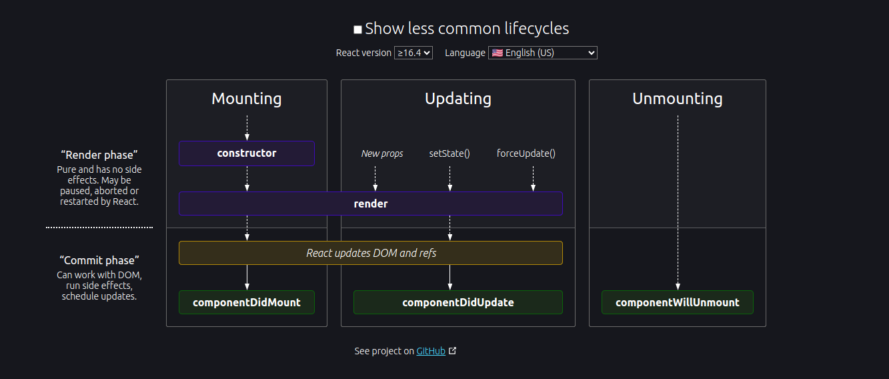
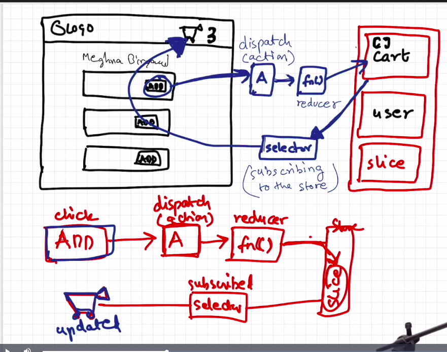

Q: What is NPM?
Ans: NPM does not have full form, basically NPM manages the packages.

Q: What is package.json?
Ans: Configuration file for NPM.

Q: Why do we need package.json file?
Ans: 

# Two types of dpendencies, one is dev dependencies and another one is normal dependencies.
    = Dev Dependencies is responsible for development and normal dependencies can be deploy on production server.

Q: What is the difference between ~ and ^ in package.json file.
Ans: When we use ^ with version, it'll automatically installed the minor release, and when we use ~, It'll automatically installed the
    major release version.

Q: What's package-lock.json file?
Ans: Keep a track of exact version of dependencies is installed.

Q: What is node module?
Ans: Node Modules is a collection of dependecies.

Q: What is parcel?
Ans: Parcel used for create dev build, create server and automatically refresh your page HMR(Hot Module Replacement).
    - Parcel using File Watching Algorithm. 
    - Parcel is also caching the things for you. 
    - Parcel also do the image optimization.
    - If we create the prod build, Parcel will minification of the file.
    - Parcel will compress the file as well.
    - Parcel do consistent hashing.
    - It'll do code splitting for you.
    - Differential Building - support older browsers
    - Parcel gives you the feature where you can host your website on https.
    - Give us Tree shaking. - Parcel will remove unused code.
    - It created different dev and prod bundles

- To create production build, run command `npx parcel build index.html`

Q: What is JSX?
Ans: JSX is a convention, where we can merge our html and javascript together.
    - JSX code converted into react.CreateElement code.

Q: What is Babel.
Ans : Bable is JS compiler. It comiles the JS code which browser understands.
      Bable basically converts your jsx code into React.CreateEelement.
      If you need to give properties like class or tabindex, inside jsx, you need to give it in camel-case like className, tabIndex.

Q: What type of component in React?
Ans: Class based component - Old way to write the component - It uses JS classes to create component
     Functional based component : New way to write the component - It uses JS function to create component

Q: What's the functional component ?
Ans: Functional component is a normal JS functions, which returns the JSX code or react element.

Q: What's the class component ?
Ans: 

Q: Why do we need super props?
Ans: 

Q: What is component composition ?
Ans: When more than one component combined into each other, called component composition.

Q: What is props?
Ans: When you have to pass the dynamic data to the components, we need to pass as props.

Q: Config driven UI - Based on configuration, UI will display the data.

Q: What type of import export we have.
Ans: Two type of import and export
    - Named import
        ex : import { name } from "path"
    - default import
        ex: import name from "path"
    - Name export
        ex : export const key1
            export const key2
    - default export
        ex: default export key

Q: What is React hooks?
Ans: React hook is normal JS function.
    - useState() --> Used to generate state variable in React
    - useEffect() --> syntax --> useEffect(() =>, []), first argument called callback function and another one is dependency array.
    - Whenever a state variable is changes, React re-render the component.

# useEffect => When the dependency array is not presemt, then it'll call whenever our component re-render
# When there is an empty dependency error is present, it'll call once when first time re-render will happen.
# If dependency array is present (not empty), then useEffect call when that dependency will change.

Q: Reconcilation Alogorithm (React Fiber)
Ans: REact creates virtual DOM, when any chnages happen in UI
        virtual DOM : is representation of actual DOM.

Q: What is Diff Algorithm?
Ans: It basically tries to find the difference between old virtual DOM and new virtual DOM.

Q: Why React is fast?
Ans: React is doing efficient dom manupulation because it has virtual DOM.

Q: How many ways to fetch the data.
Ans : There are two ways
        - As soon as our page load, we will get the data from an API, and then we render in UI
        - First we load the UI, render the data and as soon as we get the data from API, we re-render the data again.

# Whenever you change the local state variable, React re-render the whole componenet.
# Whenever state variable updates, react triggers a reconcilation cycle (re-render the component)

Q: Whats is the use of Outlet?
Ans: Outlete, replace by the child component based on the path provided to it.

Q: Difference between anchor and Link in React?
Ans: 

Q: Two types of routing in web application
Ans: 1. Server side routing
     2. Client side routing

# React has two phase
    - Render Phase
    - Commit phase
    

Q: What is hiher order component ?
Ans: Higher component is a component, which takes one component and return a component.

Q: What is control and uncontrol component?

Q: What is lifting state up in the react.

Q: What is props drilling?

Q: What is react context
Ans : To avoid the props drilling, we can use react context.

Q: useContext

Q: What is Redux and what is advantage of Redux?
Ans: 

Q: What is Redux store?
Ans: Redux store is a very big JS object with lots of data inside it. which kept in a gloabl central space.

Q: What is reducer ?
Ans: When you press the add button, it dispatches an action which call the reducer function, which updates the slice of the redux store.

#  

Q: Redux 
    - ConfigureStore - to create the store, it comes from (reduxjs)
    - Provide : to provide the store to our react app, it comes from (react/redux)
    - createSlice: used to create the slice
    - useSelector : to fetch the data
    - useDispatch : to dispacth the event

# Setting up testing framework in our react application
    - Install React Testing Library
    - Install Jest
    - Install Babel dependencies
    - Configure Babel
    - Configure parcel confif file to diable default Babel configuration (As Babel inside using parcel)
    - Jest Configuration (npx jest --init)
    - install JSDOM library
    - Install @babel/preset-react - to make JSX work in test cases
    - Include @babel/preset-react inside babel config
    - npm i -D @testing-library/jest-dom